# 📝 Todo App

This application was built as part of a **30-hour React Native Bootcamp**.  
The main goal of this project was to strengthen my understanding of **React Native fundamentals** and build a **fully functional mobile todo application** from scratch.

---

## 📷 Screenshots

### 🌙 Dark Mode

  
  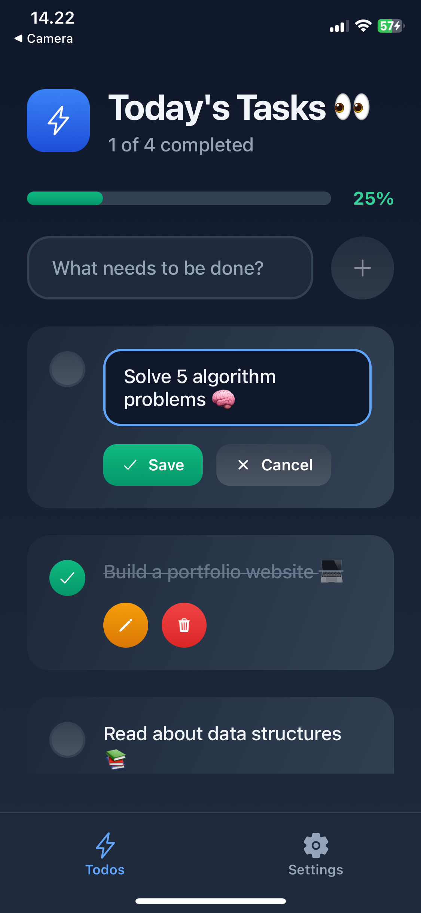
  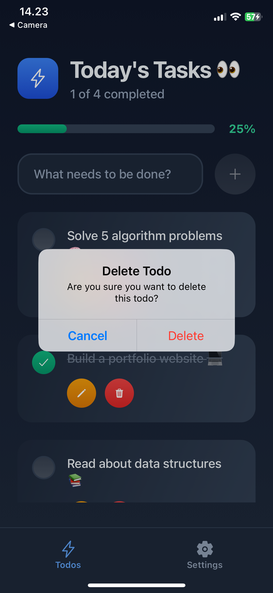

**Todos Screen** • **Editing Todo** • **Delete Alert**

  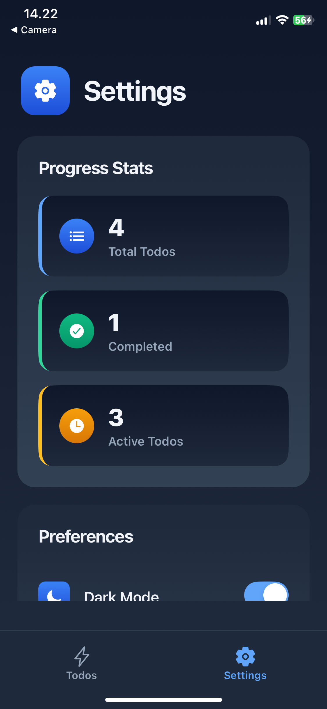
  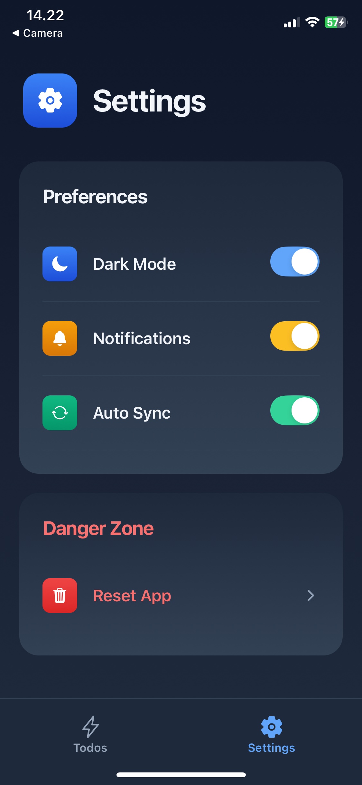
  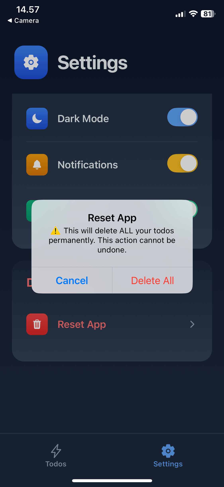

**Settings Stats** • **Settings Preferences** • **Reset App Warning**

  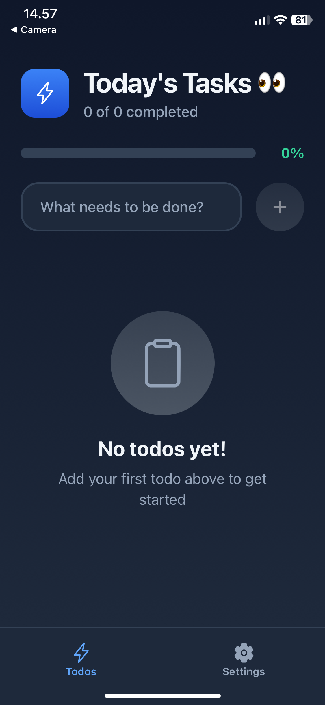

**Empty State**

---

### ☀️ Light Mode

  
  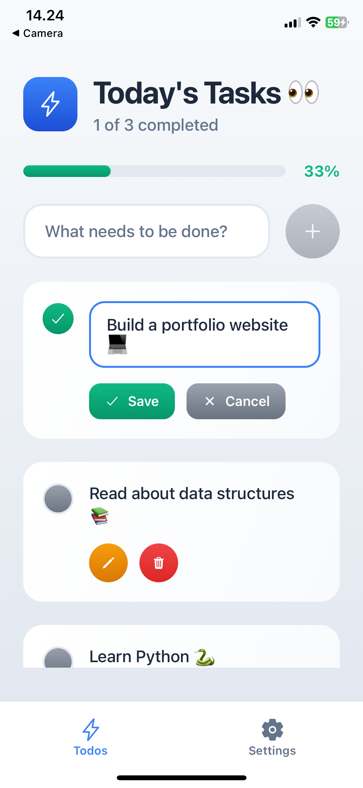
  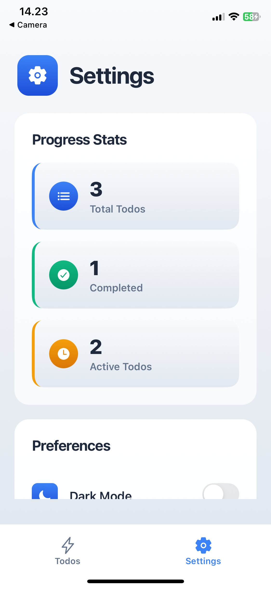

**Todos Screen** • **Editing Todo** • **Delete Alert**

  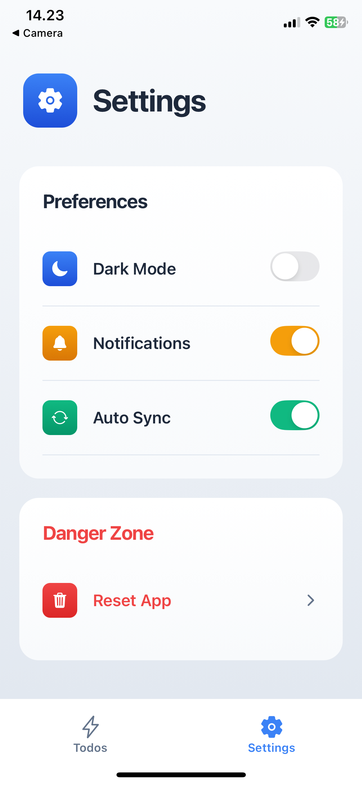
  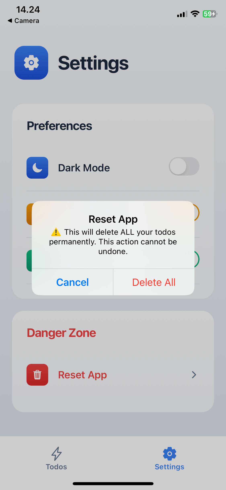
  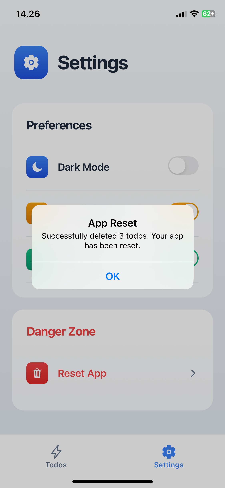

**Settings Stats** • **Settings Preferences** • **Reset App Warning**

---

## 🚀 What I Learned

While building this app, I practiced and learned a wide range of modern React Native techniques and development tools:

### 📱 React Native Fundamentals

- Building UI components using `View`, `Text`, `FlatList`, `TouchableOpacity`, `Switch`, `TextInput`, etc.
- Applying responsive styles using `StyleSheet` and custom styling hooks
- Working with `SafeAreaView` for safe layouts on iOS and Android

### 🎨 Theming & Styling

- Implementing light and dark themes with a custom `useTheme` hook
- Creating reusable gradient styles using **LinearGradient**
- Organizing all styles in modular style files (`.style.ts`)

### ⚡ State & Logic

- Managing local component state with `useState`
- Handling user interactions (add, edit, toggle, delete todos)
- Using `Alert` for confirmation dialogs

### 🧠 Data Layer (Convex)

- Fetching and mutating data using **Convex**
- Writing and using server-side functions: `getTodos`, `toggleTodo`, `updateTodo`, `deleteTodo`, `clearAllTodos`
- Understanding `useQuery` and `useMutation` hooks

### ⚙️ Architecture & Structure

- Organizing the app into screens and reusable components
- Following clean file structure: `components/`, `app/tabs/`, `hooks/`, `convex/`

---

## ⚡ Features

- Add, toggle, edit and delete todos
- Track progress stats (total, completed, active todos)
- Switch between dark and light mode
- Toggle notifications and auto sync preferences
- Reset all todos with a single tap (Danger Zone)
- Beautiful and consistent UI with gradient styles

---

## 📦 Tech Stack

- **React Native**
- **Expo**
- **Convex** (for backend & data storage)
- **Expo Router**
- **TypeScript**
- **Ionicons** (icons)
- **LinearGradient** (from `expo-linear-gradient`)
